# AgroPool
Portal for Farmers to sell the produce at a better rate 
#### Problem statement in Description 
  - System that provides farmers an interface to sell their produce , and connect with the buyers all over India 
  - Simple interface that works on mobile, SMS to upload produce details and respond via phone and SMS (taking care of digital divide) 
  - Interface for anyone to buy the produce/vegetable – initially visit the place and buy or have courier service integrated to deliver the vegetables 
  - Farmers can get a better price for their produce, no additional cost spent in marketing and delivery of goods , however they can choose to charge more by delivering the items themselves 
#### Purpose of this analysis and who will benefit 
  - Farmers, Restaurant owners, Buyers , Courier Companies, Delivery Agencies, Vegetable Vendors 
#### How does it help the nation   
  - Better rates for the vegetables, Make the Farmers live with pride and make additional income 
#### Practical and reasons why this idea could be a challenge o Brokers , Govt rules 
  - Overall profitability in the deal for the buyer to purchase directly from farm , excluding transportation 
#### Technology that can be used as a platform for connecting car buyer to Seller Domain Bucket 
  - Agriculture 
  - E-Commerce 
  - Payment 

### Implementation

- We implemented two door system in which farmer and buyers have their own experience with this application.

#### Application screens for farmers view

Starting of an application |  Registration Screen for farmers |  Login Screen for farmers  |  Menu for farmer  |  Crop and location selection screen  |  Buyers and their offered cost for particular crop  |  Dealer profile with message and call options  
:-------------------------:|:-------------------------:|:-------------------------:|:-------------------------:|:-------------------------:|:-------------------------:|:-------------------------:
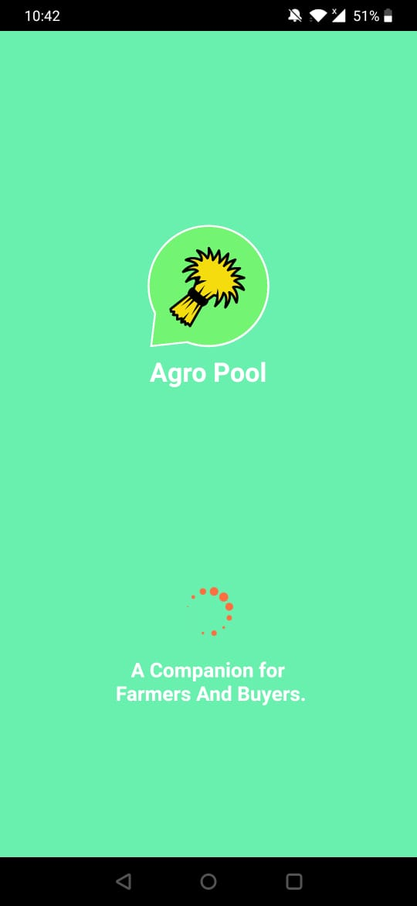 | 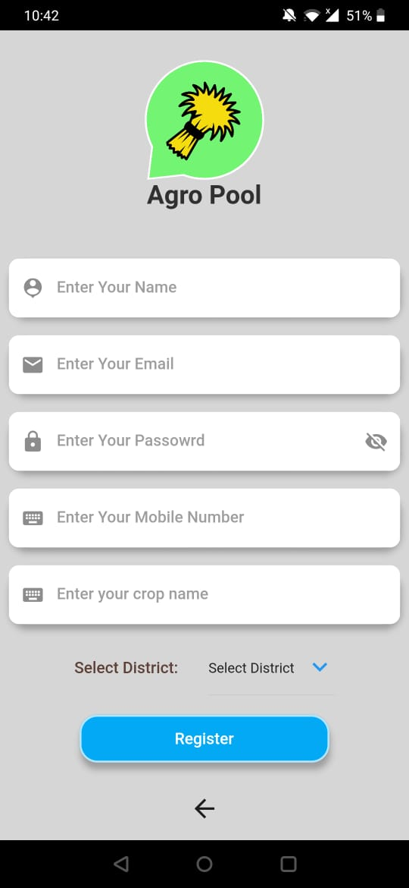 | 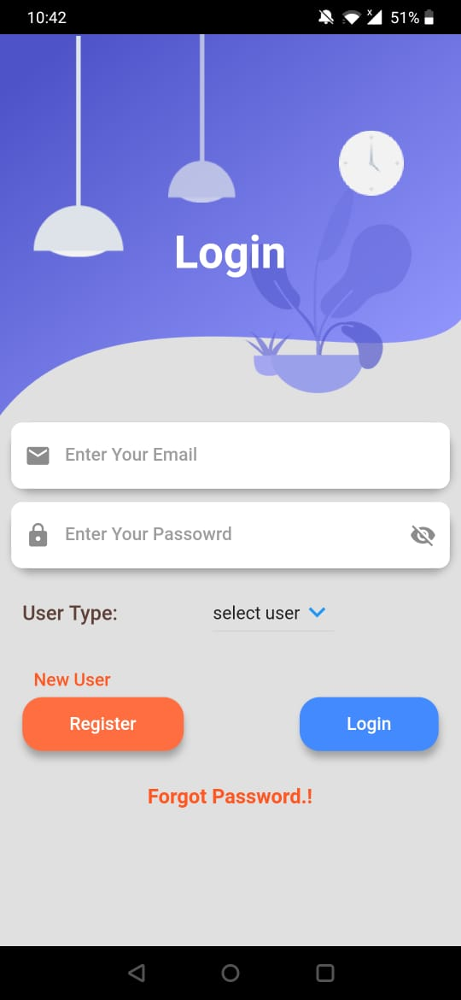 | 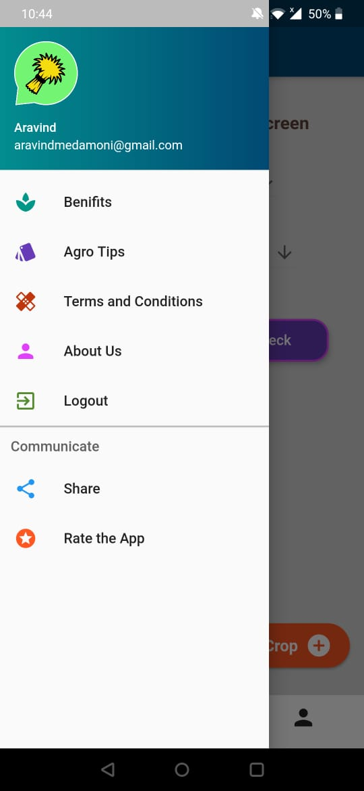 | 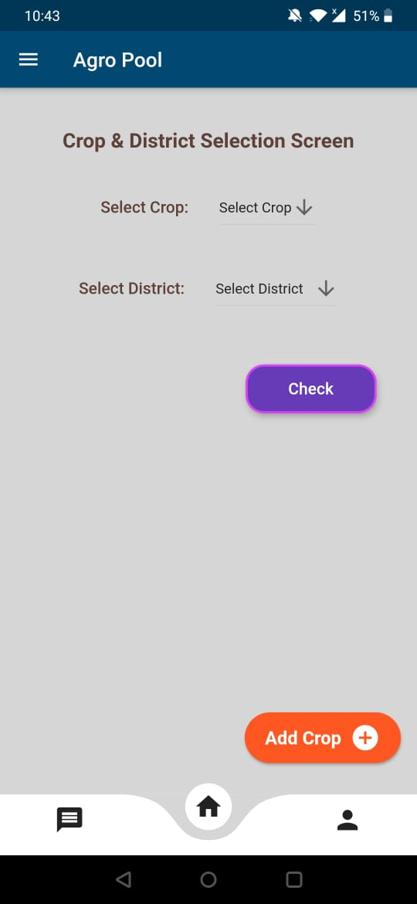 |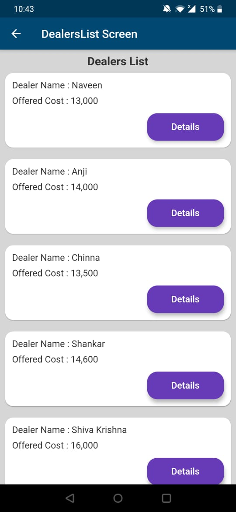 |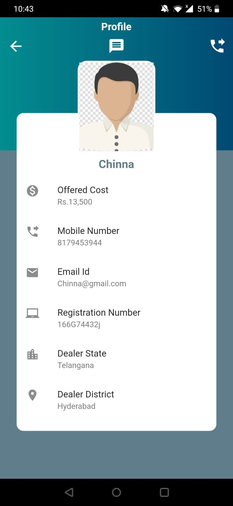 

#### Application screens for Buyers view

Starting of an application |  Registration Screen for buyers |  Login Screen for buyers  |  Profile screen for buyers  |  Edit profile screen  |  Add crop screen  |  Offer cost to particular farmer by chat with them  |  Chat screen
:-------------------------:|:-------------------------:|:-------------------------:|:-------------------------:|:-------------------------:|:-------------------------:|:-------------------------:|:-------------------------:
 |  |  | 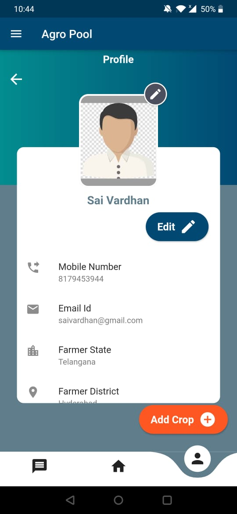 | 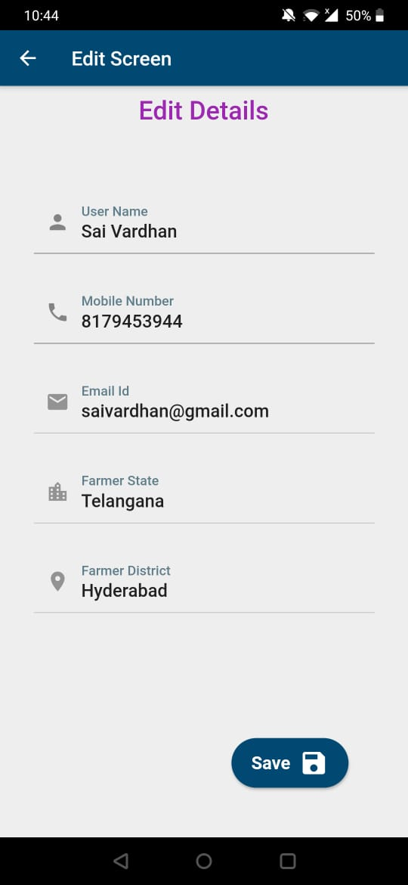 |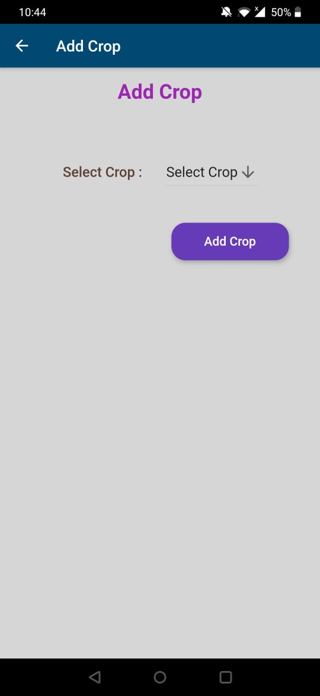 |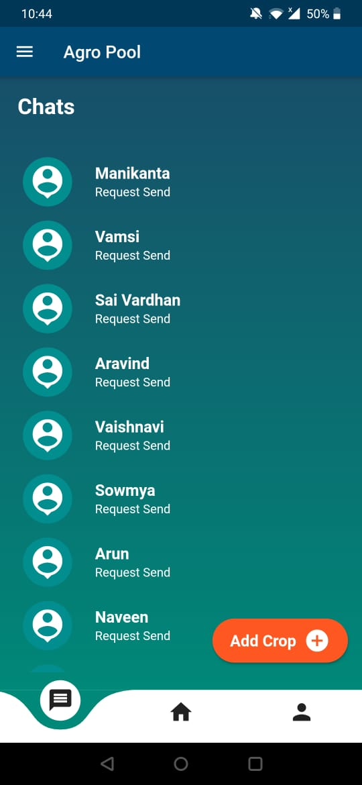 |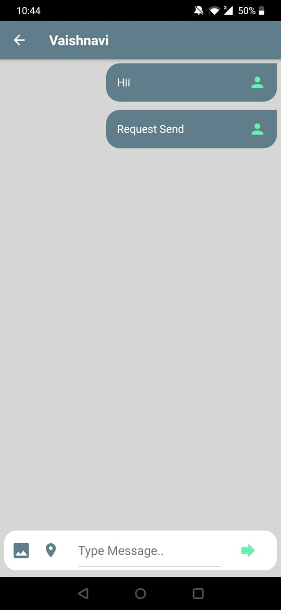 